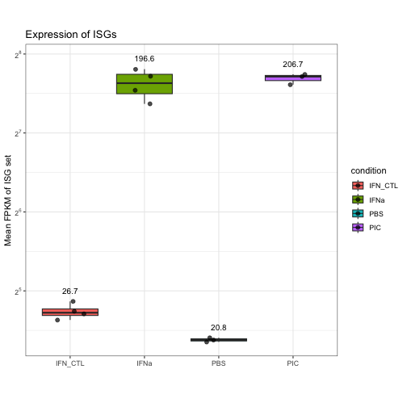

``` r
#--------------------------------------------------------------------
# LOAD PACKAGES
#--------------------------------------------------------------------
library(readr)
library(tidyverse)
library(dplyr)
library(pheatmap)
library(ggpubr)

#--------------------------------------------------------------------
# DATA IMPORT AND CLEANUP
#--------------------------------------------------------------------
list_of_files <- list.files(path = "../XR261_DESeq2/output",
                            recursive = FALSE,
                            pattern = "DEG.tsv",
                            full.names = TRUE)

# filter for files that contain IFNb exactly once
filtered_files <- list_of_files[str_detect(list_of_files, "BMEC_PIC_vs_BMEC_PBS")]

data <- readr::read_tsv(filtered_files, id = NULL)
```

```
## Rows: 20521 Columns: 9
## ── Column specification ───────────────────────────────────────────────────────────────────────────────────────────────────────────────────────────────────────────────────
## Delimiter: "\t"
## chr (2): gene_id, comparison_name
## dbl (7): comparison, baseMean, log2FoldChange, lfcSE, stat, pvalue, padj
## 
## ℹ Use `spec()` to retrieve the full column specification for this data.
## ℹ Specify the column types or set `show_col_types = FALSE` to quiet this message.
```

``` r
data_fpkm <- read.delim("../XR261_DESeq2/output/XR261_FPKM.tsv")
data_fpkm <- data_fpkm %>%
  dplyr::select(matches("^(gene|BMEC)"))

#--------------------------------------------------------------------
# EXTRACT SIGNIFICANT GENES AND USE FPKM CUTOFF
#--------------------------------------------------------------------
adj_pval_cutoff = 0.05
log2FC_cutoff = 1
FPKM_cutoff = 1

# sort by gene and by log2FC high to low and remove duplicates
data_sig <- data %>%
  arrange(gene_id, desc(log2FoldChange)) %>%
  distinct(gene_id, .keep_all = T) %>%
  dplyr::select(gene_id,log2FoldChange,padj)

# filter for genes meeting pval and log2FC cutoffs
data_sig <- data_sig %>%
  filter(padj < adj_pval_cutoff, log2FoldChange > log2FC_cutoff)

# merge with FPKM data, add mean fpkm and filter for fpkm cutoff
data_sig <- data_fpkm %>%
  dplyr::rename(gene_id = gene) %>%
  left_join(data_sig) %>%
  na.omit() %>%
  mutate(
    mean_PBS  = rowMeans(dplyr::select(., contains("PBS"))),
    mean_PIC = rowMeans(dplyr::select(., contains("PIC")))
  ) %>%
  mutate(
    mean_all = rowMeans(dplyr::select(., starts_with("mean")))
  )
```

```
## Joining with `by = join_by(gene_id)`
```

``` r
data_sig <- data_sig %>%
  filter(mean_all > FPKM_cutoff) %>%
  dplyr::select(matches("^(gene|BMEC)"))

#--------------------------------------------------------------------
# GET LIST OF ISGs FROM XR252
#--------------------------------------------------------------------
# get list of ISG names and save to file
data_ISG <- read.delim("input/XR252_ISG_expression_BMEC.tsv")
data_ISG <- data_ISG %>%
  dplyr::select(matches("^(gene|BMEC_PBS|BMEC_IFN)")) %>%
  dplyr::rename_with(~ str_replace(.x, "^BMEC_PBS", "BMEC_IFN_CTL"))

#--------------------------------------------------------------------
# CALCULATE GENE SET EXPRESSION ACROSS CONDITIONS
#--------------------------------------------------------------------
# merge IFN induced genes with PIC induced genes
ISG_fpkm <- data_ISG %>%
  left_join(data_sig) %>%
  dplyr::rename(gene = gene_id) %>%
  na.omit()
```

```
## Joining with `by = join_by(gene_id)`
```

``` r
# make genes rownames delete gene column
ISG_fpkm <- as.data.frame(ISG_fpkm)
rownames(ISG_fpkm) <- ISG_fpkm$gene
ISG_fpkm$gene = NULL

# calculate average ISG FPKM value per sample
ISG_set_expression <- colSums(ISG_fpkm)/nrow(ISG_fpkm)

# write ISG expression values to file
ISG_set_expression_df <- data.frame(
  condition = names(ISG_set_expression),
  ISG_expression = as.numeric(ISG_set_expression),
  row.names = NULL,
  stringsAsFactors = FALSE) %>%
  write_tsv("output/XR261_ISG_set_expression.tsv")

#--------------------------------------------------------------------
# PLOT SUMMARY DATA as BARPLOTS
#--------------------------------------------------------------------
# define metadata/groups
metadata <- data.frame(
  sample_id = colnames(ISG_fpkm),
  condition = c(rep("IFN_CTL", 4), rep("IFNa", 4), 
                rep("PBS", 3), rep("PIC", 3))
)

# combine metadata with data to plot
plot_data <- metadata %>%
  mutate(score = ISG_set_expression[sample_id])

plot_data$condition <- factor(plot_data$condition, levels = c("IFN_CTL", "IFNa", "PBS", "PIC"))

# prepare y axis breaks and labels
max_exp <- ceiling(log2(max(plot_data$score, na.rm = TRUE)))
breaks <- 2^(0:max_exp)
labels <- parse(text = paste0("2^", 0:max_exp))

# prepare labels and position
label_data <- plot_data %>%
  group_by(condition) %>%
  summarise(mean_val = mean(score, na.rm = TRUE),
            y_pos = max(score, na.rm = TRUE) * 1.1)

# plot data
ggplot(plot_data, aes(x = condition, y = score, fill = condition)) +
  geom_boxplot(outlier.shape = NA) +
  geom_jitter(width = 0.2, size = 2, alpha = 0.7) +
  geom_text(data = label_data,
            aes(x = condition, y = y_pos, label = round(mean_val, 1)),
            inherit.aes = FALSE,
            size = 3.5,
            color = "black") +
  scale_y_continuous(
    trans = "log2",
    breaks = breaks,
    labels = labels) +
  labs(
    title = "Expression of ISGs",
    y = "Mean FPKM of ISG set",
    x = "") +
  theme_bw() +
  theme(aspect.ratio = 1)
```



``` r
ggsave("output/XR261_ISG_set_expression.pdf", width = 10, height = 10, units = "in", dpi = 300)
dev.off()
```

```
## pdf 
##   2
```

``` r
#--------------------------------------------------------------------
# CURATE DATA JOIN DATASETS INDUCED BY POLYIC AND IFNA KEEP ALL THAT ARE UP BY POLYIC
#--------------------------------------------------------------------
# merge PIC induced genes with IFNa induced genes but keep all from PIC
data_all_IFNa <- read.delim("../../XR252_BMEC_IFN_RNAseq/XR252_RNAseq_analyses_AL/XR252_DESeq2/output/XR252_FPKM.tsv")
data_all_IFNa <- data_all_IFNa %>%
  dplyr::rename_with(~ str_replace(.x, "^BMEC_PBS", "BMEC_IFN_CTL")) %>%
  rename(gene_id = gene)

data_fpkm <- data_sig %>%
  left_join(data_all_IFNa) %>%
  na.omit()
```

```
## Joining with `by = join_by(gene_id)`
```

``` r
# make genes rownames delete gene column
data_fpkm <- as.data.frame(data_fpkm)
rownames(data_fpkm) <- data_fpkm$gene_id
data_fpkm$gene_id = NULL

#--------------------------------------------------------------------
# PLOT HEATMAP OF INDIVIDUAL VALUES GENES UP BY POLYIC
#--------------------------------------------------------------------
# define formula to calculate row Z score
cal_z_score <- function(x){
  (x - mean(x)) / sd(x)
}

# calculate row Z score for FPKMs for each row (gene) of interest
data_fpkm_norm <- t(apply(data_fpkm, 1, cal_z_score))

# annotate sample columns
my_sample_col <- data.frame(sample = c(rep("PBS",3),
                                       rep("PIC",3),
                                       rep("IFN_CTL",4),
                                       rep("IFNa",4)),
                            condition = c(rep("ctl",3),
                                          rep("polyIC",3),
                                          rep("ctl",4),
                                          rep("IFNa",4)))

row.names(my_sample_col) <- colnames(data_fpkm)

# calculate dendrogram
hc <- hclust(dist(data_fpkm_norm), method = "complete")

# add cluster information to heatmap
numberofclusters = 4
my_gene_col <-cutree(hc, k = numberofclusters)
my_gene_col <- data.frame(cluster = ifelse(test = my_gene_col == 1, yes = "1",
                                           ifelse(test = my_gene_col == 2, yes = "2",
                                                  ifelse(test = my_gene_col == 3, yes = "3", no = "4"))))

# add ISG information to heatmap
ISG_list <- data_ISG$gene_id
my_gene_col$ISG <- ifelse(rownames(my_gene_col) %in% ISG_list, 1, 0)

pheatmap(data_fpkm_norm, annotation_col = my_sample_col, annotation_row = my_gene_col, 
         show_rownames = F, main = "genes induced by poly(I:C)",
         #color = colorRampPalette(c("midnightblue", "ivory", "firebrick3"))(50),
         cutree_rows = numberofclusters,
         filename = "output/XR261_ISG_heatmap_individual.pdf")

# add cluster and ISG information to DEG list
my_gene_col$gene_id <- rownames(my_gene_col)
data_fpkm$gene_id <- rownames(data_fpkm)
data_save <- data_fpkm %>%
  left_join(my_gene_col) %>%
  na.omit() %>%
  dplyr::relocate(gene_id) %>%
  arrange(cluster)
```

```
## Joining with `by = join_by(gene_id)`
```

``` r
write_tsv(data_save, "output/XR261_ISG_heatmap_individual.tsv")

#--------------------------------------------------------------------
# PLOT HEATMAP OF MEAN VALUES GENES UP BY POLYIC
#--------------------------------------------------------------------
# add means for all conditions
data_fpkm_mean <- data_fpkm %>%
  mutate(
    mean_PBS  = rowMeans(select(., starts_with("BMEC_PBS"))),
    mean_PIC = rowMeans(select(., starts_with("BMEC_PIC"))),
    mean_IFN_CTL  = rowMeans(select(., starts_with("BMEC_IFN_CTL"))),
    mean_IFNa = rowMeans(select(., starts_with("BMEC_IFNa")))) %>%
    # add mean for controls
    mutate(mean_CTL = rowMeans(select(., matches("^mean_(PBS|IFN_CTL)$")))
  )

# keep mean FPKM values only
data_fpkm_mean <- data_fpkm_mean %>%
  dplyr::select(contains(c("mean"))) %>%
  dplyr::select(mean_CTL, mean_PIC, mean_IFNa)

# calculate row Z score for FPKMs for each row (gene) of interest
data_fpkm_mean_norm <- t(apply(data_fpkm_mean, 1, cal_z_score)) 

# annotate sample columns
my_sample_col <- data.frame(sample = c(rep("CTL",1),
                                       rep("PIC",1),
                                       rep("IFNa",1)),
                            condition = c(rep("ctl",1),
                                          rep("polyIC",1),
                                          rep("IFNa",1)))

row.names(my_sample_col) <- colnames(data_fpkm_mean)

# calculate dendrogram
hc <- hclust(dist(data_fpkm_mean_norm), method = "complete")

# add cluster information to heatmap
numberofclusters = 3
my_gene_col <-cutree(hc, k = numberofclusters)
my_gene_col <- data.frame(cluster = ifelse(test = my_gene_col == 1, yes = "1",
                                           ifelse(test = my_gene_col == 2, yes = "2", no = "3")))

# add ISG information to heatmap
my_gene_col$ISG <- ifelse(rownames(my_gene_col) %in% ISG_list, 1, 0)

# plot heatmap
pheatmap(data_fpkm_mean_norm, annotation_col = my_sample_col, annotation_row = my_gene_col, 
         show_rownames = F, main = "genes induced by poly(I:C)",
         #color = colorRampPalette(c("midnightblue", "ivory", "firebrick3"))(50),
         cutree_rows = numberofclusters,
         filename = "output/XR261_ISG_heatmap_means.pdf")

# add cluster and ISG information to DEG list
my_gene_col$gene_id <- rownames(my_gene_col) 
data_fpkm$gene_id <- rownames(data_fpkm)
data_save <- data_fpkm %>%
  left_join(my_gene_col) %>%
  na.omit() %>%
  dplyr::relocate(gene_id) %>%
  arrange(cluster)
```

```
## Joining with `by = join_by(gene_id)`
```

``` r
write_tsv(data_save, "output/XR261_ISG_heatmap_means.tsv")   

#--------------------------------------------------------------------
# APPENDIX
#--------------------------------------------------------------------
# which R packages and versions?
if ("devtools" %in% installed.packages()) devtools::session_info()
```

```
## ─ Session info ──────────────────────────────────────────────────────────────────────────────────────────────────────────────────────────────────────────────────────────
##  setting  value
##  version  R version 4.5.2 (2025-10-31)
##  os       macOS Sonoma 14.7.3
##  system   aarch64, darwin20
##  ui       RStudio
##  language (EN)
##  collate  en_US.UTF-8
##  ctype    en_US.UTF-8
##  tz       America/New_York
##  date     2026-04-29
##  rstudio  2024.12.1+563 Kousa Dogwood (desktop)
##  pandoc   NA
##  quarto   1.5.57 @ /Applications/RStudio.app/Contents/Resources/app/quarto/bin/quarto
## 
## ─ Packages ──────────────────────────────────────────────────────────────────────────────────────────────────────────────────────────────────────────────────────────────
##  package      * version date (UTC) lib source
##  abind          1.4-8   2024-09-12 [1] CRAN (R 4.5.0)
##  backports      1.5.0   2024-05-23 [1] CRAN (R 4.5.0)
##  bit            4.6.0   2025-03-06 [1] CRAN (R 4.5.0)
##  bit64          4.6.0-1 2025-01-16 [1] CRAN (R 4.5.0)
##  broom          1.0.11  2025-12-04 [1] CRAN (R 4.5.2)
##  cachem         1.1.0   2024-05-16 [1] CRAN (R 4.5.0)
##  car            3.1-3   2024-09-27 [1] CRAN (R 4.5.0)
##  carData        3.0-5   2022-01-06 [1] CRAN (R 4.5.0)
##  cli            3.6.5   2025-04-23 [1] CRAN (R 4.5.0)
##  commonmark     2.0.0   2025-07-07 [1] CRAN (R 4.5.0)
##  crayon         1.5.3   2024-06-20 [1] CRAN (R 4.5.0)
##  devtools       2.4.6   2025-10-03 [1] CRAN (R 4.5.0)
##  dplyr        * 1.1.4   2023-11-17 [1] CRAN (R 4.5.0)
##  ellipsis       0.3.2   2021-04-29 [1] CRAN (R 4.5.0)
##  evaluate       1.0.5   2025-08-27 [1] CRAN (R 4.5.0)
##  farver         2.1.2   2024-05-13 [1] CRAN (R 4.5.0)
##  fastmap        1.2.0   2024-05-15 [1] CRAN (R 4.5.0)
##  forcats      * 1.0.1   2025-09-25 [1] CRAN (R 4.5.0)
##  Formula        1.2-5   2023-02-24 [1] CRAN (R 4.5.0)
##  fs             1.6.6   2025-04-12 [1] CRAN (R 4.5.0)
##  generics       0.1.4   2025-05-09 [1] CRAN (R 4.5.0)
##  ggplot2      * 4.0.1   2025-11-14 [1] CRAN (R 4.5.2)
##  ggpubr       * 0.6.2   2025-10-17 [1] CRAN (R 4.5.0)
##  ggsignif       0.6.4   2022-10-13 [1] CRAN (R 4.5.0)
##  glue           1.8.0   2024-09-30 [1] CRAN (R 4.5.0)
##  gtable         0.3.6   2024-10-25 [1] CRAN (R 4.5.0)
##  hms            1.1.4   2025-10-17 [1] CRAN (R 4.5.0)
##  knitr          1.51    2025-12-20 [1] CRAN (R 4.5.2)
##  lifecycle      1.0.4   2023-11-07 [1] CRAN (R 4.5.0)
##  litedown       0.9     2025-12-18 [1] CRAN (R 4.5.2)
##  lubridate    * 1.9.4   2024-12-08 [1] CRAN (R 4.5.0)
##  magrittr       2.0.4   2025-09-12 [1] CRAN (R 4.5.0)
##  markdown       2.0     2025-03-23 [1] CRAN (R 4.5.0)
##  memoise        2.0.1   2021-11-26 [1] CRAN (R 4.5.0)
##  mime           0.13    2025-03-17 [1] CRAN (R 4.5.0)
##  otel           0.2.0   2025-08-29 [1] CRAN (R 4.5.0)
##  pheatmap     * 1.0.13  2025-06-05 [1] CRAN (R 4.5.0)
##  pillar         1.11.1  2025-09-17 [1] CRAN (R 4.5.0)
##  pkgbuild       1.4.8   2025-05-26 [1] CRAN (R 4.5.0)
##  pkgconfig      2.0.3   2019-09-22 [1] CRAN (R 4.5.0)
##  pkgload        1.4.1   2025-09-23 [1] CRAN (R 4.5.0)
##  purrr        * 1.2.0   2025-11-04 [1] CRAN (R 4.5.0)
##  R6             2.6.1   2025-02-15 [1] CRAN (R 4.5.0)
##  ragg           1.5.0   2025-09-02 [1] CRAN (R 4.5.0)
##  RColorBrewer   1.1-3   2022-04-03 [1] CRAN (R 4.5.0)
##  readr        * 2.1.6   2025-11-14 [1] CRAN (R 4.5.2)
##  remotes        2.5.0   2024-03-17 [1] CRAN (R 4.5.0)
##  rlang          1.1.6   2025-04-11 [1] CRAN (R 4.5.0)
##  rstatix        0.7.3   2025-10-18 [1] CRAN (R 4.5.0)
##  rstudioapi     0.17.1  2024-10-22 [1] CRAN (R 4.5.0)
##  S7             0.2.1   2025-11-14 [1] CRAN (R 4.5.2)
##  scales         1.4.0   2025-04-24 [1] CRAN (R 4.5.0)
##  sessioninfo    1.2.3   2025-02-05 [1] CRAN (R 4.5.0)
##  stringi        1.8.7   2025-03-27 [1] CRAN (R 4.5.0)
##  stringr      * 1.6.0   2025-11-04 [1] CRAN (R 4.5.0)
##  systemfonts    1.3.1   2025-10-01 [1] CRAN (R 4.5.0)
##  textshaping    1.0.4   2025-10-10 [1] CRAN (R 4.5.0)
##  tibble       * 3.3.0   2025-06-08 [1] CRAN (R 4.5.0)
##  tidyr        * 1.3.2   2025-12-19 [1] CRAN (R 4.5.2)
##  tidyselect     1.2.1   2024-03-11 [1] CRAN (R 4.5.0)
##  tidyverse    * 2.0.0   2023-02-22 [1] CRAN (R 4.5.0)
##  timechange     0.3.0   2024-01-18 [1] CRAN (R 4.5.0)
##  tzdb           0.5.0   2025-03-15 [1] CRAN (R 4.5.0)
##  usethis        3.2.1   2025-09-06 [1] CRAN (R 4.5.0)
##  vctrs          0.6.5   2023-12-01 [1] CRAN (R 4.5.0)
##  vroom          1.6.7   2025-11-28 [1] CRAN (R 4.5.2)
##  withr          3.0.2   2024-10-28 [1] CRAN (R 4.5.0)
##  xfun           0.55    2025-12-16 [1] CRAN (R 4.5.2)
## 
##  [1] /Library/Frameworks/R.framework/Versions/4.5-arm64/Resources/library
##  * ── Packages attached to the search path.
## 
## ─────────────────────────────────────────────────────────────────────────────────────────────────────────────────────────────────────────────────────────────────────────
```

